+++
date = '2026-07-05T18:13:28+08:00'
draft = false
title = '模块surfing更优雅使用海外软件'    

categories = [
    "工具"
]    

image = "137483887_p0_master1200.jpg"

+++

# 如何更优雅使用移动端gemini gpt [linux.do](http://linux.do) githud

**本文章只做学术研究 一切行为遵守国家法律**

移动端每次访问外网软件手忙脚乱 打开魔法 打开谷歌 然后等待魔法生效访问

这种方法低效且浪费时间 

并且可能因为改变ip位置导致某些国产软件将账号封禁 

如何像肉身在墙外 自如打开外网软件网站

有的

兄弟 有的

我们可以使用内核代理选择哪些应用走代理 哪些不需要走

达到我们上述目的

# 准备工作 

1 需要一台root手机 且安装root管理器（magisk kus）和lsp框架

系统在安卓8以上

2依旧双手聪明大脑和细心眼睛

3熟练使用root权限与刷机技巧

ps 本文章只对三星盖乐世s23u oneui8.5系统进行演示 其他设备可以查询官方链接讨论

[GitMetaio/Surfing: Magisk and KernelSU modules for Clash/mihomo services.](https://github.com/GitMetaio/Surfing)

下载模块

刷入

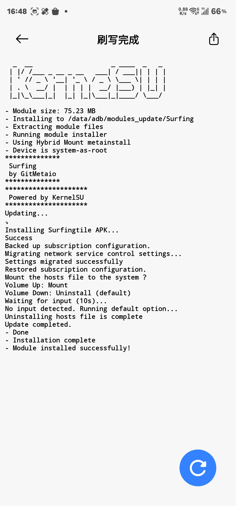

ps 别忘记lsp激活对选中系统

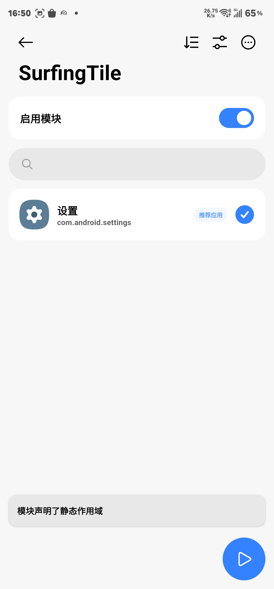

重启

# 配置设置

打开软件surfing

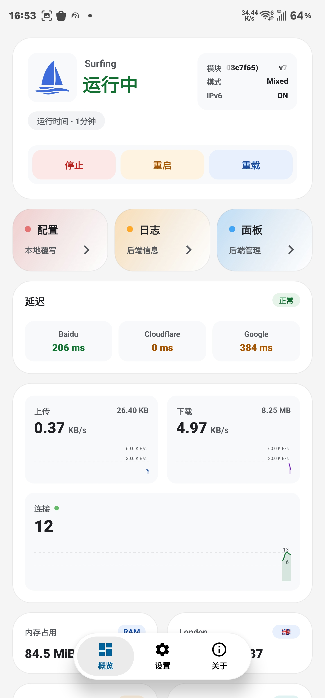

点击配置

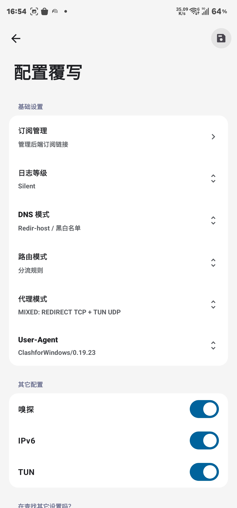

点击订阅管理

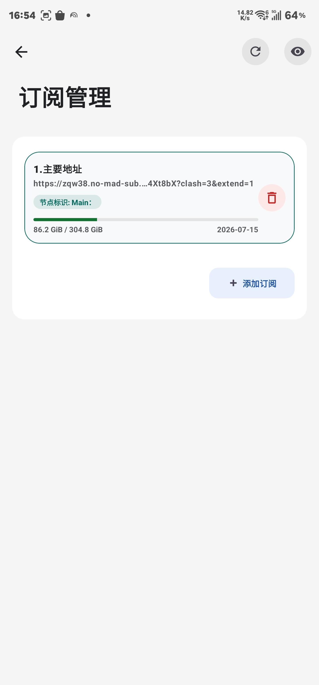

添加链接

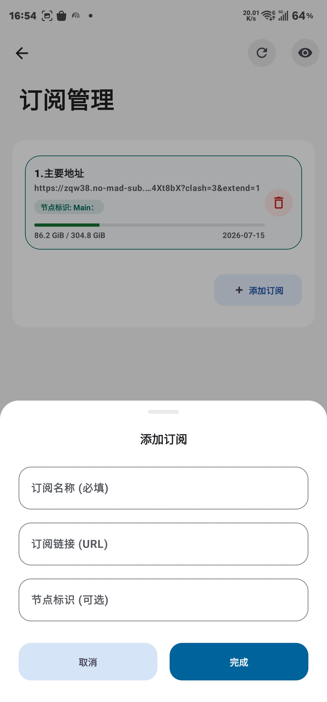

填写你代理链接

完成

返回配置覆写页面

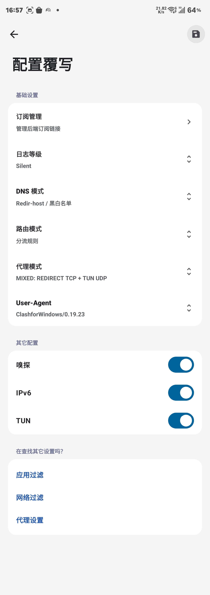

ps 我建议其他是不要动 打开下面三个选项（ipv6看你的代理支不支持 可以查询或者通过浏览器搜索ipv6测试）

我将介绍页面重要选项

dns

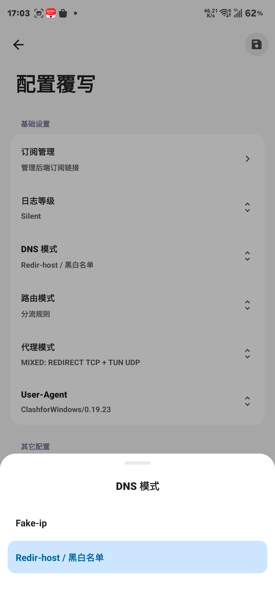

优缺点对比（纯干货）：

模式 优点 缺点

Fake-ip 1. 极快：不用等DNS查完，瞬间响应，网页秒开。 2. 防污染：假IP在本地，不怕运营商或墙给错IP，代理分流更精准。 3. 节省资源：减少大量DNS反复查询。 1. 兼容性差：极少数“较真”的软件（如某些游戏、企业级APP）不认假IP，会连接失败。 2. 日志乱码：你看到访问日志都是198.18.x.x，看不出具体访问了哪个网站，排查问题费劲。

Redir-host （传统模式） 1. 兼容性最好：所有软件都认得真IP，几乎不会因为网络环境导致连不上。 2. 直观：日志里看到的IP都是真实的，排错和抓包非常清晰。 1. 速度慢：每次连接都要等DNS回合，有延迟，尤其访问国外网站时感觉明显。 2. 易污染：国内网络环境下，解析敏感域名容易被抢答或返回错误IP，导致分流失效或访问失败。

\---

给你的选择建议（抄作业）：

· 日常用：无脑选 Fake-ip（默认推荐），速度快且主流软件都适配。

· 玩硬核游戏/连公司内网/遇见APP报错：切到 Redir-host 试试，能解决大部分莫名其妙的连接问题。

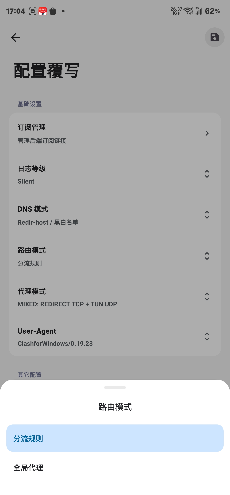

字面意思 选择规则代理

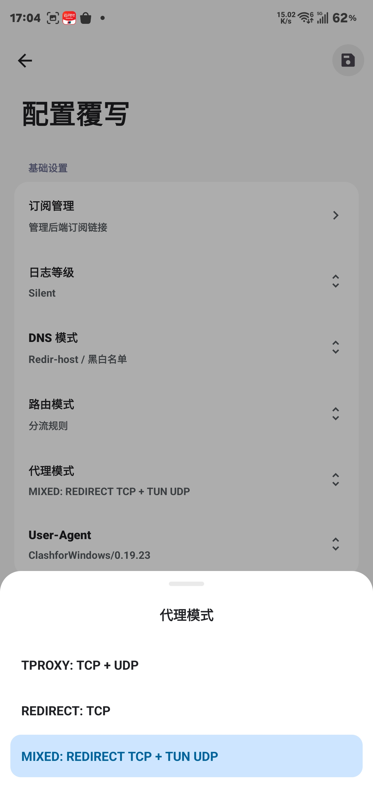

代理模式

模式 优点 缺点 适用系统

REDIRECT   兼容性最强，几乎不会导致底层网络报错，配置最简单。 不支持UDP（游戏联机、DNS泄露会出问题）；会丢失原始目标IP，可能导致分流失准。

TPROXY     完美支持TCP+UDP，且保留真实目标IP，分流最精准，性能最高（无需虚拟网卡）。 门槛极高！仅限Linux系统（如软路由OpenWrt）

MIXED 鱼和熊掌兼得：

TCP稳定（REDIRECT）+ UDP支持（TUN），Windows/macOS也能愉快打游戏和解析DNS。 TCP部分依然丢失原始IP（可能影响分流）；需要开启TUN模式，占用少量额外系统资源。 

这里推荐mixed模式

ps ：这个选项叫 User-Agent（用户代理），大白话就是你 Clash 客户端去订阅机场（服务器）那里“领配置”时递出的“身份证/名片”。

服务器看到这个“名片”，就知道你是哪款软件，然后可能会给你发不同格式的配置文件。

\---

这些选项分别代表啥（对号入座）：

选项 代表哪个软件/内核 使用场景

ClashMetaForAndroid/2.11.2.Meta 安卓手机上的Clash Meta客户端（如Surfing、CFA） 如果你是安卓手机用户，选这个最匹配

Clash-verge/v2.2.3 电脑上的Clash Verge（Windows/macOS/Linux桌面版） 如果你是电脑桌面用户，选这个最匹配

ClashforWindows/0.19.23 经典的Clash for Windows（CFW）（已停更但用户量大） 伪装万金油，绝大多数机场都完美兼容这个

Clash.meta Clash Meta内核的通用标识（不指定前端界面） 适合纯命令行或不确定前端时用

Mihomo Clash Meta内核的最新官方改名字（Meta已改名为Mihomo） 极客尝鲜，支持最新特性，但部分老旧机场可能不认

这里我推荐选择 windows 

选择应用过滤

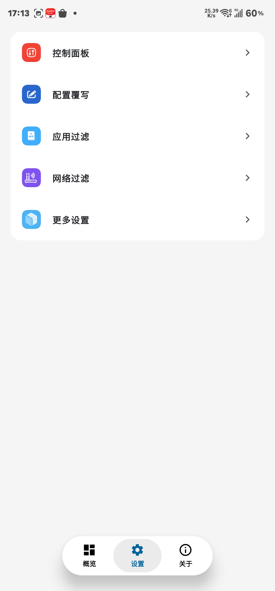

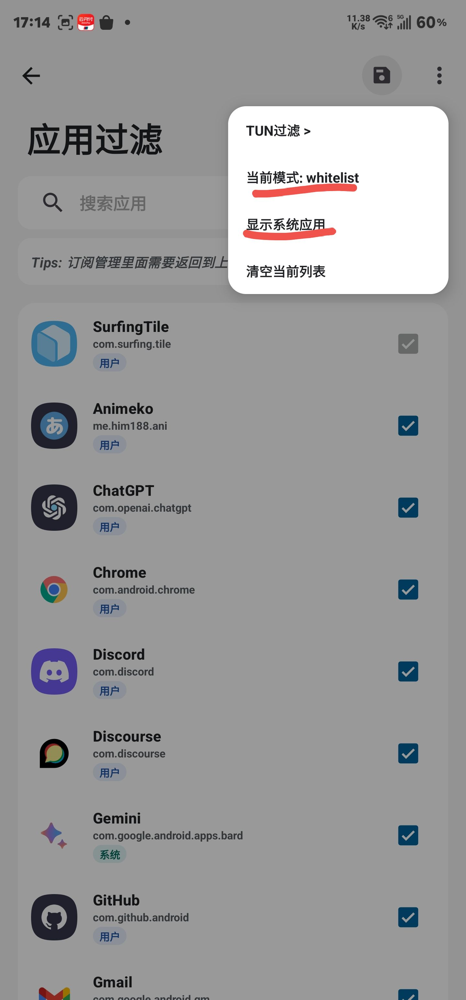

切换为白名单代理 选择应用走代理

选择显示系统应用 勾选Google相关系统应用

勾选需要代理的软件 

因为我们走的是混合代理 所以tun过滤也需要配置

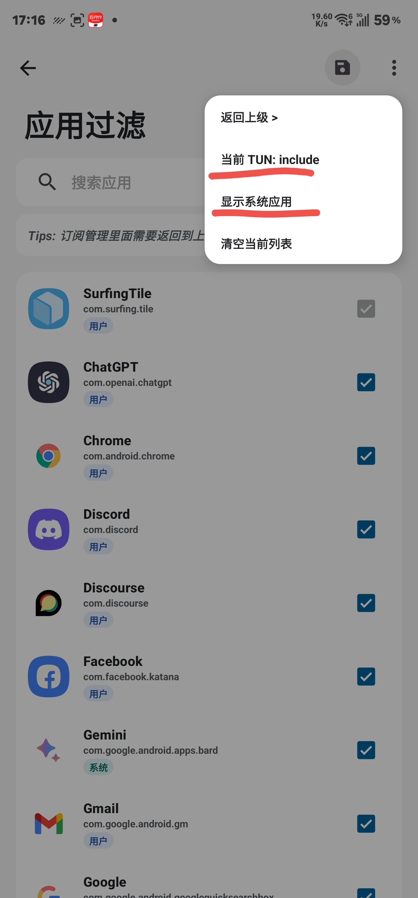

选择白名单

显示系统应用 选择Google相关系统软件

选择代理软件

**别忘保存**

**别忘保存**

**别忘保存**

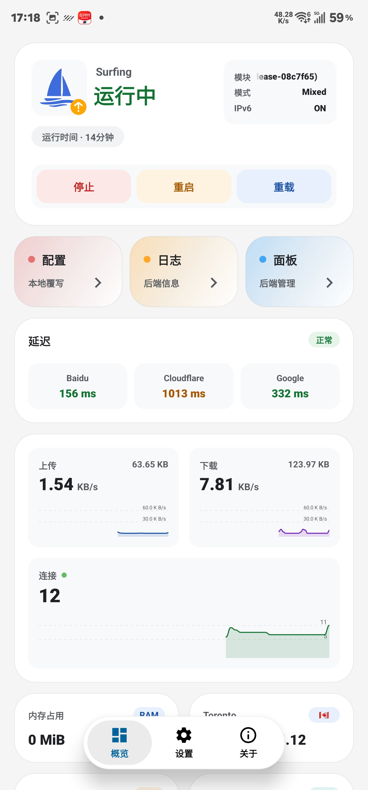

点击重启 进行代理

点开面板选项

点击代理

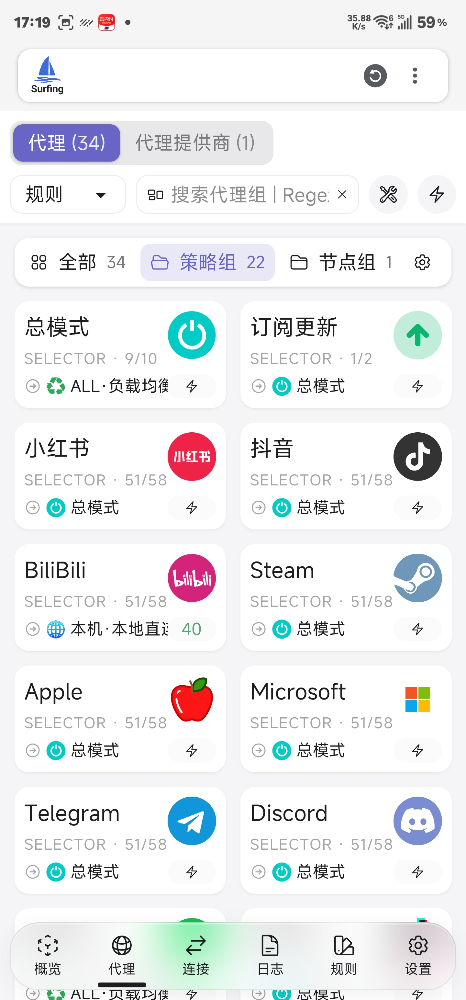

然后把Google代理选择

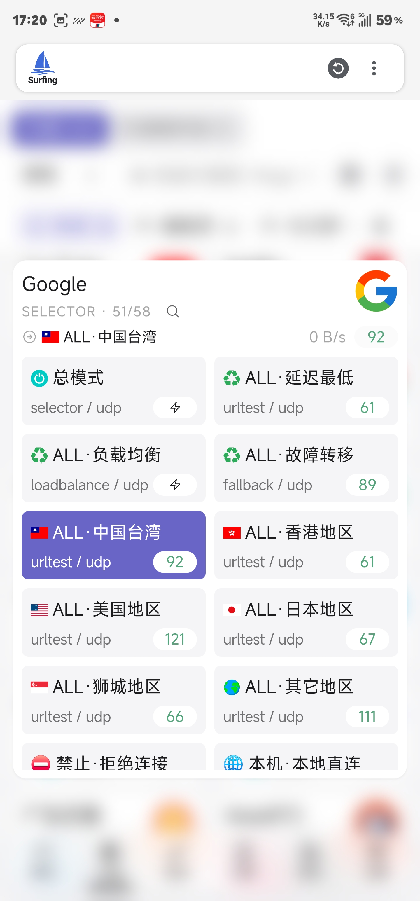

中国台湾 新加坡 美国（ps 其他地区如香港对代理审查严格 一些ai软件如gemini gpt notebooklm无法正常使用）

返回主页面 点击重启服务

ps

surfing更新点击主页面图标更新

享受冲浪 surfing

# 效果展示

<video src="Screen_Recording_20260705_173256.mp4"></video>
