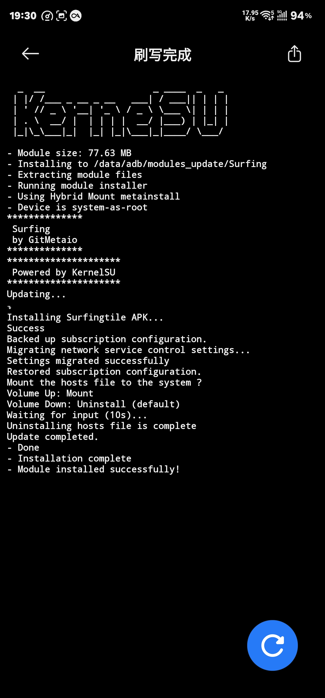
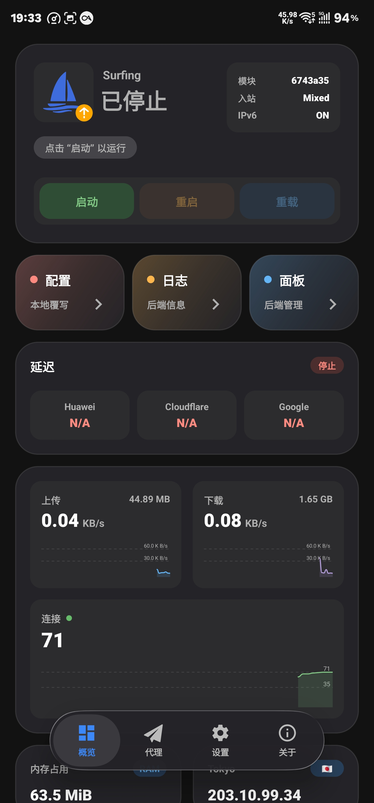
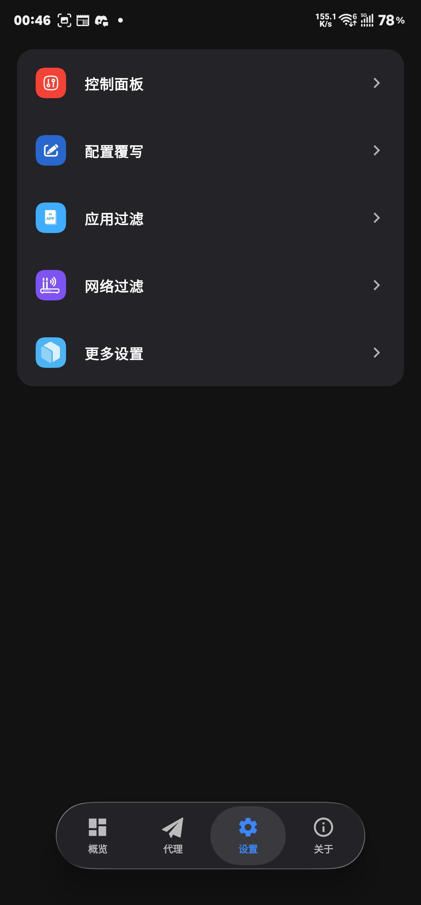
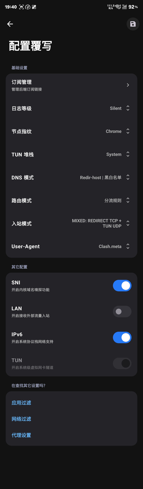
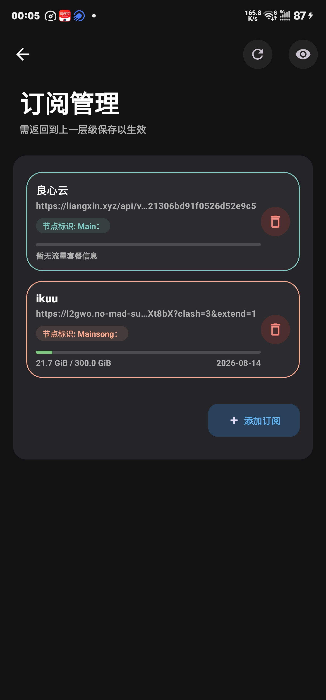
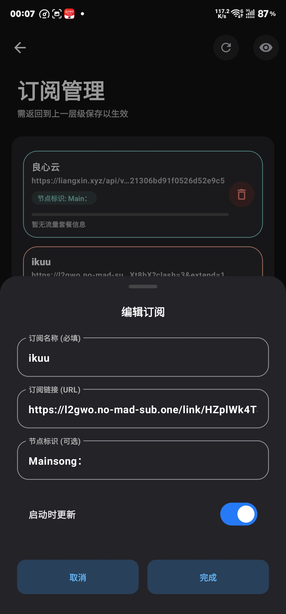
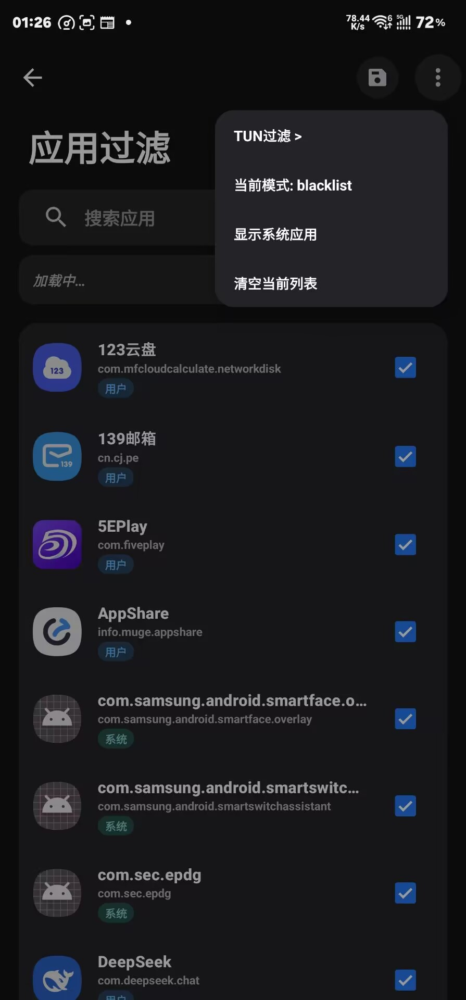
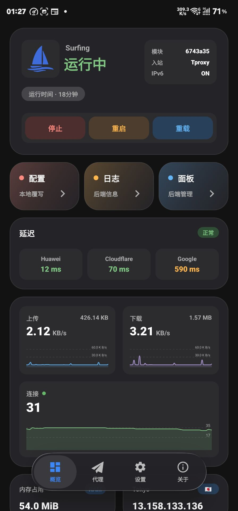

+++
date = '2026-07-17T19:11:43+08:00'
draft = false
title = '移动端更优雅访问外网'    

image = "137483887_p0_master1200.jpg"     

categories = [
    "工具",
    "代理"
]

+++

# **使用surfing需求以及surfing模块介绍**

我有很多需要翻到外网的需求

但是众所周知原因 在大陆使用外网很麻烦

启用clash 等待节点启动 打开谷歌服务 然后在打开网站app 

有些过于麻烦 且代理软件全局代理会影响国内软件正常使用 

我们可以使用surfing模块解决以上问题    

以下是surfing模块介绍：

[GitMetaio/Surfing: Magisk and KernelSU modules for Clash/mihomo services.](https://github.com/GitMetaio/Surfing)

本项目为 Clash/mihomo、sing-box、v2ray、xray、hysteria 的 [Magisk](https://github.com/topjohnwu/Magisk) 、 [Kernelsu](https://github.com/tiann/KernelSU) 、 [APatch](https://github.com/bmax121/APatch) 模块。支持 REDIRECT（仅 TCP）、TPROXY（TCP + UDP）透明代理，支持 TUN（TCP + UDP）亦可 REDIRECT（TCP）+ TUN（UDP） 混合模式代理。

基于上游为集成式一体服务、开箱即用
此适用以下人群：

- 懒癌
- 小白

项目主题及配置仅围绕 [Clash/mihomo.Meta](https://github.com/MetaCubeX/Clash.Meta)

## 准备工作

1. 一部已经解锁并root的安卓手机    
2. 下载好模块zip [GitMetaio/Surfing: Magisk and KernelSU modules for Clash/mihomo services.](https://github.com/GitMetaio/Surfing)

   3.熟悉并熟练使用root权限与模块加载

4. 一个代理节点（**提前查明自己的节点支持客户端和格式**）

 安装模块 

lsp选择系统框架并重启

重启运行模块

进入surfing app 

目前我们常用的

* 第一栏logo 点击后可以对app就行更新

* 第二栏 对代理进行配置 

目前我们代理是没有启动状态 需要我们进行配置 

点击下栏的设置

## 配置

点击第二栏的配置覆写

## 订阅管理

添加订阅

复制订阅链接到URL

 保存确定

## 按需调试

### DNS模式

Fake-IP（假IP）模式（目前最主流）
代理软件不等待真实DNS结果，而是立即返回一个保留IP（如 198.18.x.x）给应用，同时后台去查真实IP。

优点：极速响应、无DNS污染，且分流只看域名，不需要等IP，效率极高。

缺点：部分不联网的本地服务或日志记录可能会留下“假IP”。 

Redir-Host（真实IP模式）（传统模式）
应用发起请求时，代理必须先向DNS服务器查询到真实IP，再用这个IP去匹配规则（如IP段）、发起连接。

· 优点：兼容性最好，所有应用都认真实IP。

· 缺点：慢（必须等DNS响应）；容易被ISP或GFW污染；且在TUN模式下，可能因为拿不到IP导致请求卡死。

### 入站模式

* REDIRECT（重定向）：传统Linux方法，靠修改数据包目标地址来劫持流量。仅支持TCP（不支持UDP，比如游戏语音、DNS会失效），且会丢失原始目标IP，可能导致分流不准。优点是资源占用极低。

* TPROXY（透明代理）：REDIRECT的升级版。完美支持TCP+UDP，且不修改数据包头部，能完整保留原始目标IP，分流最精准。对游戏、VoIP等UDP应用最友好，是目前透明代理的最优解。

* TUN（虚拟网卡）：在系统创建虚拟网卡，从更底层接管所有IP层数据（TCP/UDP/ICMP）。兼容性最强（连Ping都能代理），但性能开销最大，且在全局模式下最容易产生“意外流量”导致堆钱。

* “MIXED:REDIRECT TCP + TUN UDP” 是混合模式——即TCP走REDIRECT，UDP走TUN。兼顾了TCP的低延迟和UDP的兼容性，但在IP纯净度上不如纯TPROXY。

  

* 纯TUN：所有流量（TCP+UDP+ICMP）全部强制塞进TUN虚拟网卡。系统层面完全感知不到代理，兼容性最强（连Ping命令都能走代理），且分流只看域名，极其精准。

  

### user-Agent

影响代理软件“自己”对外访问时的身份。

看机场支持客户端

clashwindows支持度更广

clashMetaForAndroid更新一点

# **配置完成右上角保存**

 ## 应用过滤

### tun过滤

### 当你开启混合模式“MIXED:REDIRECT TCP + TUN UDP”或纯tun模式需配置

include与exclude 理解为白名单与黑名单

​                                          

### 当前模式----黑名单白名单

顾名思义黑名单白名单过滤代理

为了更好的环境我一般选择黑名单

但可能会遇到电话打不通 和短信接受延迟

#### 黑名单问题解决方案

https://xice.cx/posts/SurfingIssueOnSamsung/

# **配置完成右上角保存**

# 启动服务

返回主菜单

点击启动服务

# end

冲浪 
